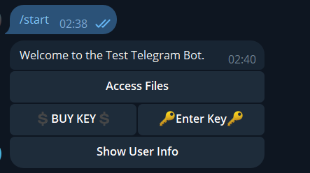
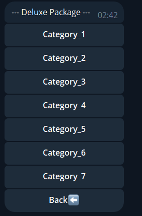
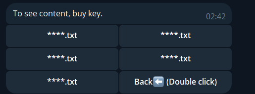
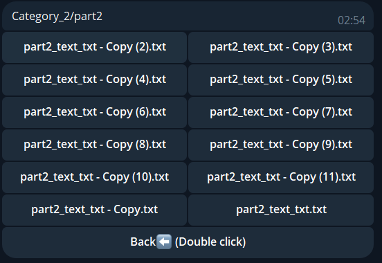
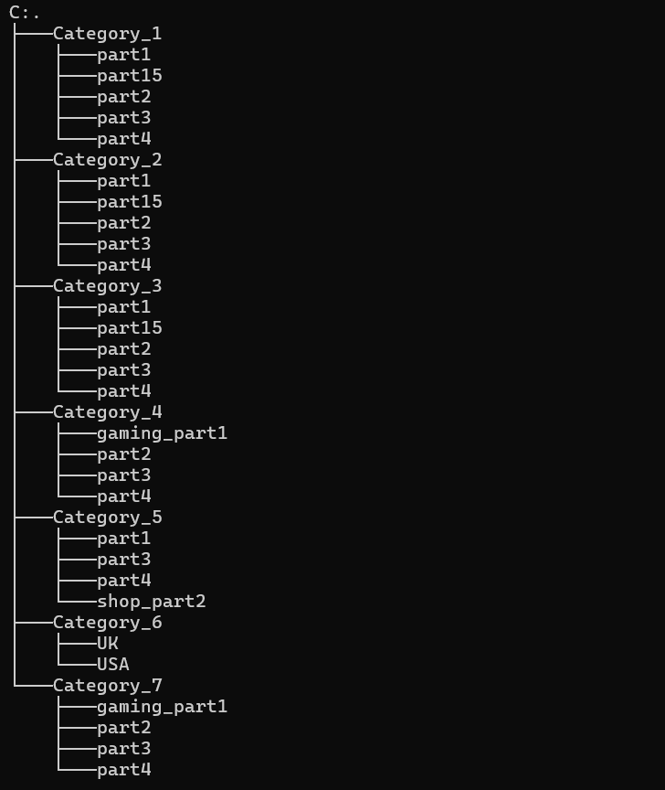
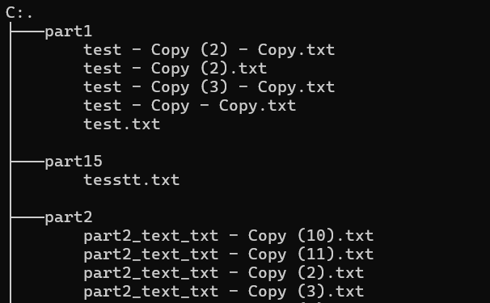

# In this repository, the python-telegram-bot library is used for learning and experimentation.

In this example, i wanted to challange myself to make a simple bot that sends your categorized files from your local pc(or cloud) to any user who has access. 

To achieve this goal, i used python-telegram-bot library for the telegram side. For the file management side, i used python's built-in os and shutil libraries. 

## The main menu has 4 buttons

- **Access Files:** You can go to the specific categories that you want and select the files you wanted to download.

 

- **Buy Key:** If the developer integrated an e-commerce system, you can buy a key to access the files.
- **Enter Key:** If you already have a key(from e-commerce system), you can enter it here.
- **Show User Info:** Shows users available subscriptions and expiration dates. As shown below.

## But while you have a key to access the datas, this is how its gonna look like:

This picture is the hierarchy of the files shown for user access.(also parts has files inside them.)

Of course this example has lots of bad sides as well as good sides. For example, it's not secure, it's not efficient, it's not scalable. Maintaining this code will be a nightmare. But, it's a good example for learning purposes. At least it was for me. I can say that nobody should use txts to store data LOL. Everthing gets messier by the minute. But in the end i can say that it was a great exprience to learn something that you didnt know before. Trying to find that specific documentation might be a nightmare but once you found it, thats the best feeling you will have.